# ApplePodcastCloneApp

## 📝 Purpose

Reproduce the Library tab of the [Apple Podcasts](https://www.apple.com/fr/apple-podcasts/) app with [IOS](https://www.apple.com/fr/ios)

- Only work on views (no model/databinding) *I might use some for the navbar animation*
- Use theme (light/dark)

## 🛠 Languages & tools

## 🖊️ Versions 

- [iOS](https://www.apple.com/ios/ios-16/) 16 *(tested)*

## 📍 Visuals

> The screenshots of the "CloneApp" were taken with an **IPhone 14 Pro Max** and might not be 100% similar to the original app.

 Library section 

| ApplePodcasts | CloneApp |
| --- | --- |
| 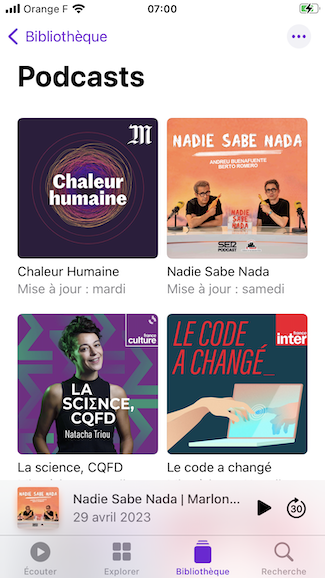 | 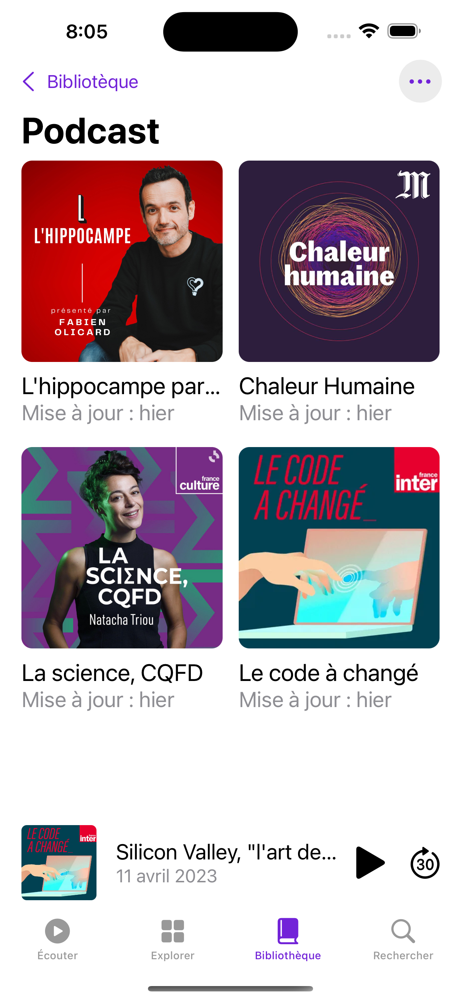 |
| 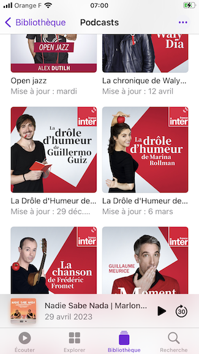 |  |
| 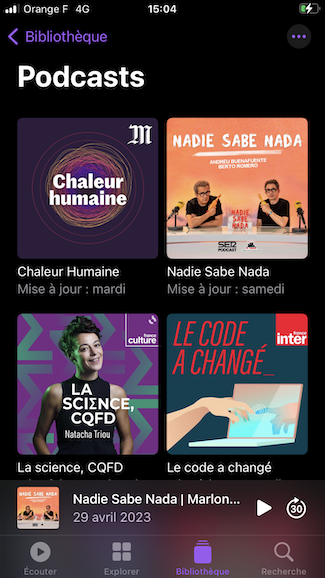 | 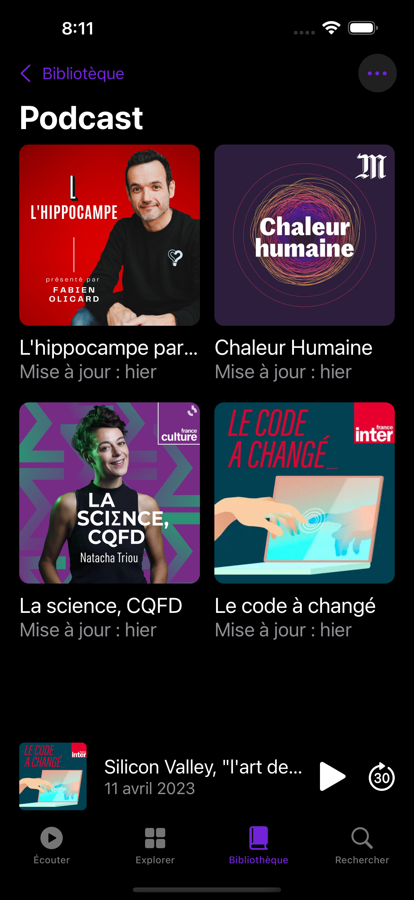 |
| 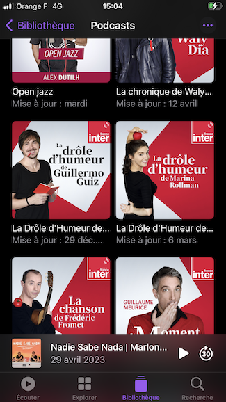 |  |

 Podcasts section 

| ApplePodcasts | CloneApp |
| --- | --- |
| 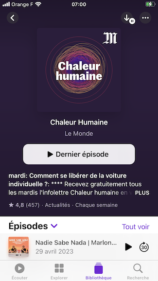 | 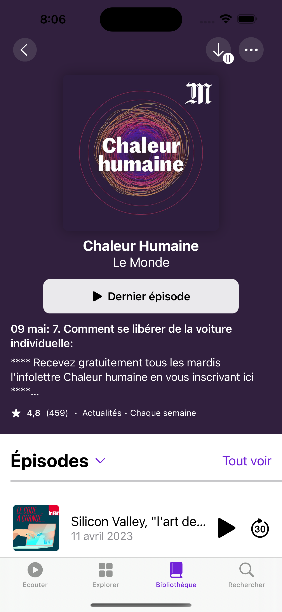 |
| 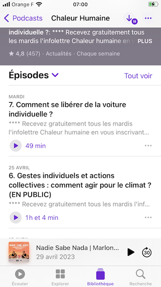 | 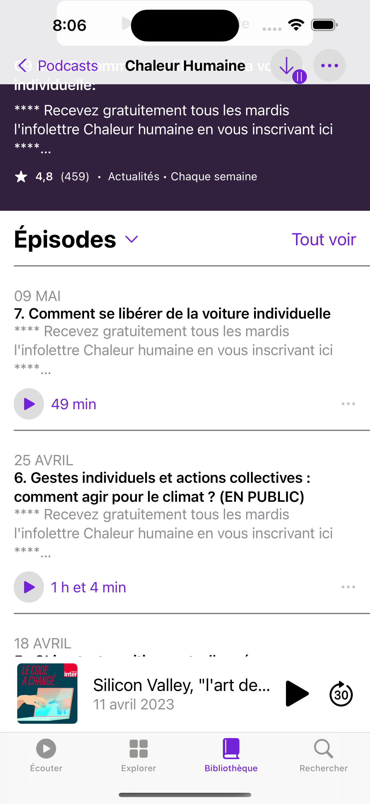 |
| 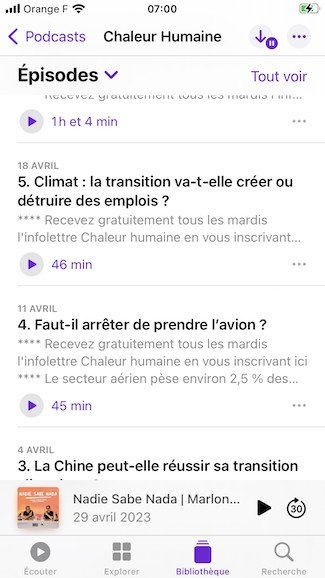 | 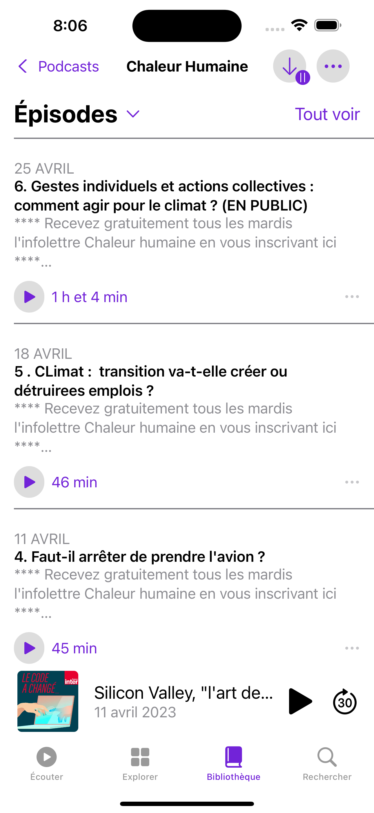 |
| 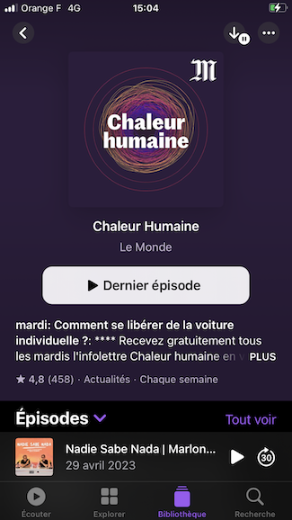 | 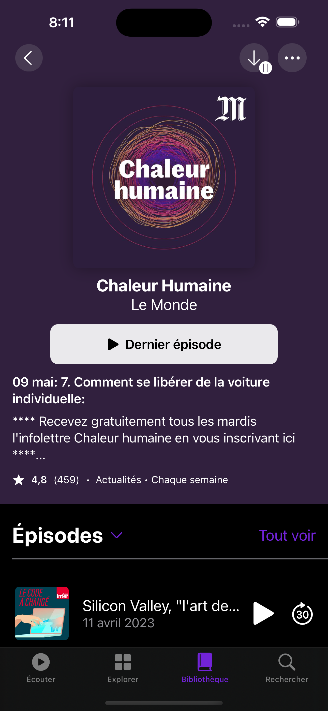 |
| 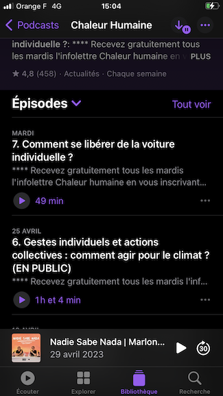 | 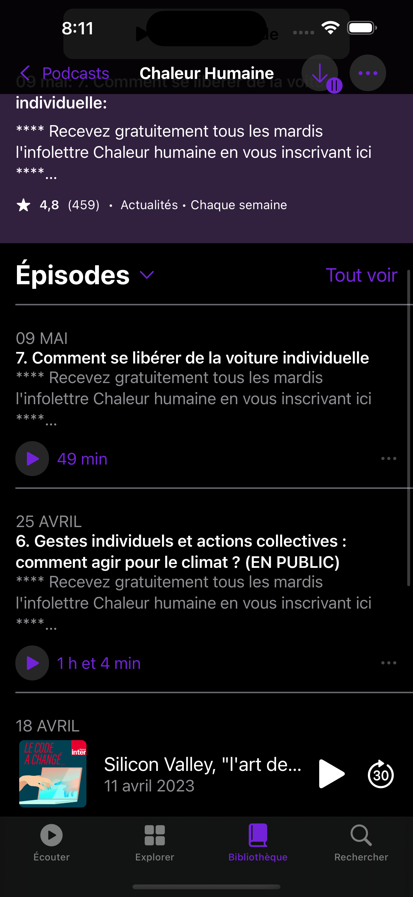 |
| 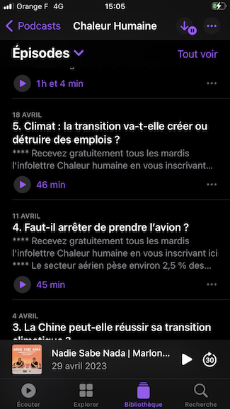 | 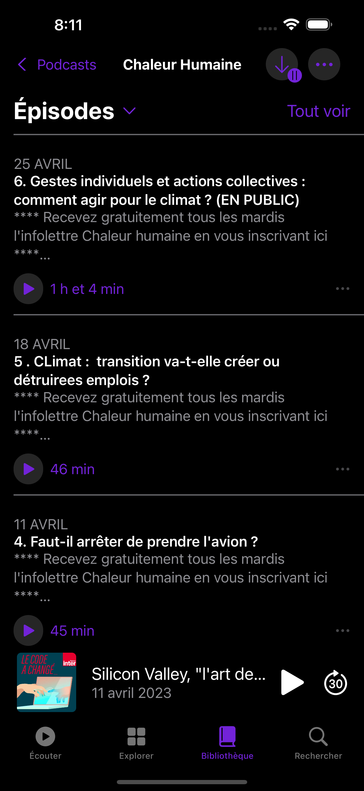 |
| 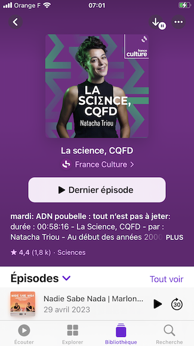 | 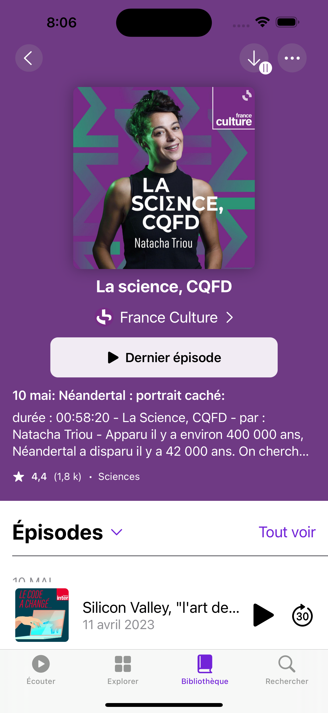 |
| 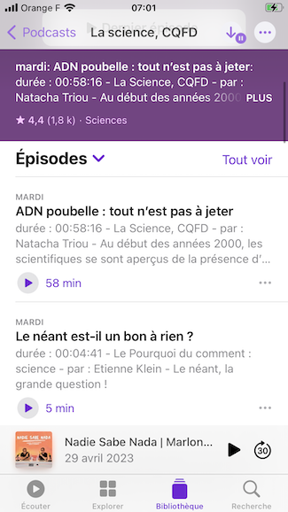 | 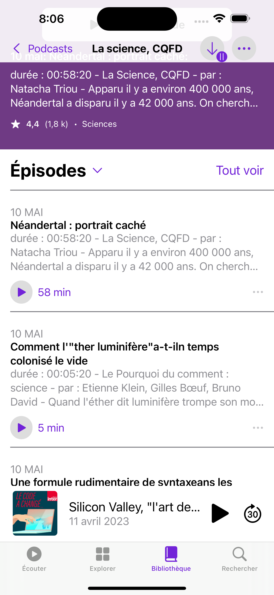 |
| 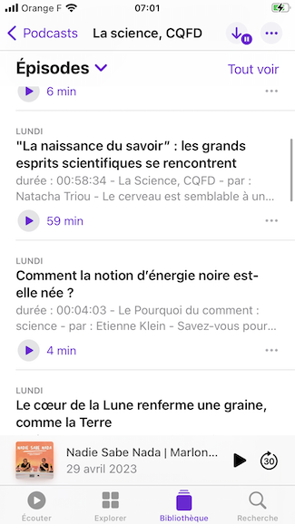 | 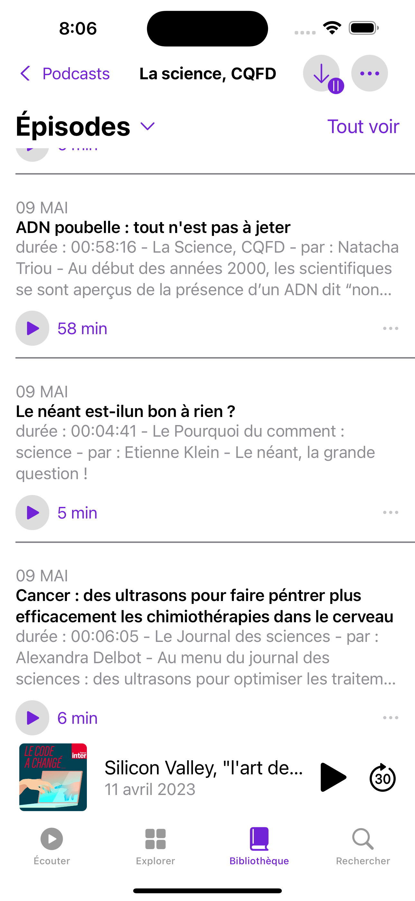 |
| 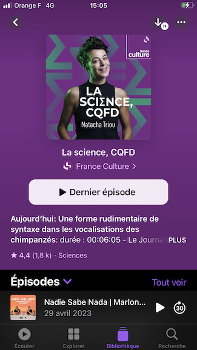 | 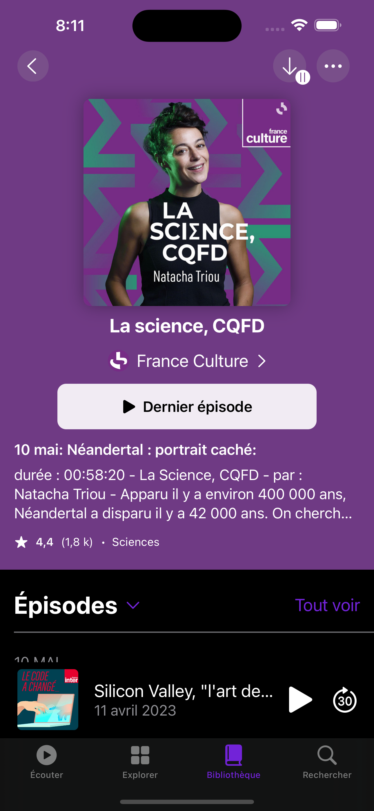 |
| 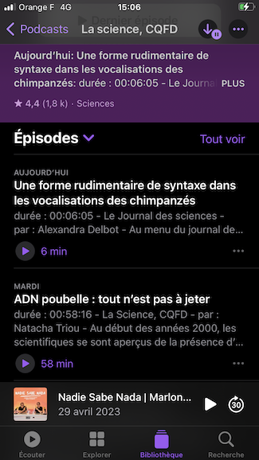 | 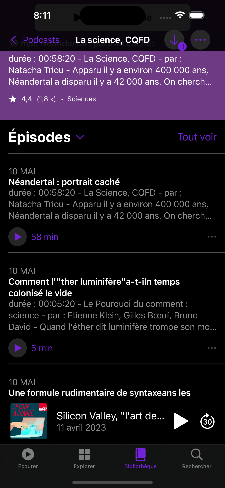 |
| 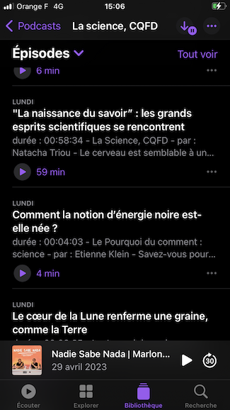 |  |

## ✍️ Credits 

* Author: [Clergue Valentin](https://github.com/HandyS11)